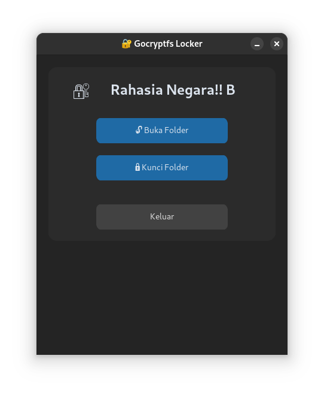

# 🔐 Gocryptfs Folder Locker GUI

A modern minimalist Python GUI to lock and unlock encrypted folders using [gocryptfs](https://github.com/rfjakob/gocryptfs), built with [CustomTkinter](https://github.com/TomSchimansky/CustomTkinter).  
Simple. Clean. Secure.

 <!-- ganti atau hapus bagian ini kalau belum punya screenshot -->

---

## ✨ Features

- 📦 Create & mount encrypted folder using `gocryptfs`
- 🔐 Unlock & lock folders securely via GUI
- 💻 Built with modern CustomTkinter (dark mode)
- 🧠 Password input with validation
- 📁 Auto-create folder if not exists

---

## 🧰 Requirements

- Python 3.8+
- Linux (Ubuntu, Fedora, etc.)
- gocryptfs
- FUSE (`fusermount`)

---

## 🧪 Installation

### 1. Install dependencies

```bash
pip install -r requirements.txt
